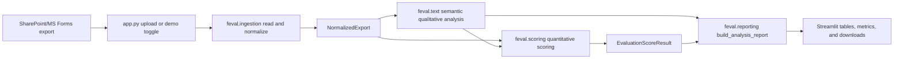

# FEU High School Teacher Performance Evaluation Platform

This repository contains a mobile-first Streamlit student evaluation portal and an administrator-facing faculty-evaluation aggregation prototype. The student portal is the current deployment target. The statistical backend separates Senior High School (SHS) and Junior High School (JHS) instruments, normalizes 5-point Likert responses, computes bounded response-context weights, summarizes open-ended comments with transparent semantic rules, and produces an auditable teacher-level result.

## Current Status

- `student_app.py` is deployed as a public-safe fictional preview at [feuhighschool-teacher-performance-evaluation.streamlit.app](https://feuhighschool-teacher-performance-evaluation.streamlit.app/), with FEU green/yellow styling, light/dark modes, roster-filtered assignments, a four-step evaluation instrument, review, submission confirmation, and history.
- `app.py` is an internal analysis prototype for local SharePoint/MS Forms exports.
- All source-controlled identities are synthetic. Raw exports, rosters, credentials, and production responses are excluded from Git.
- The hosted Supabase project is created and linked through Supabase CLI. The first two source-controlled migrations are applied, creating 14 tables, RLS policies, immutable versioned question banks, database-enforced duplicate prevention, and the atomic `submit_evaluation` RPC. A third reviewed migration adds private batch-based roster staging and is pending CLI deployment.
- The published SHS and JHS version-1 instruments contain 28 required items each: 25 Likert items and 3 qualitative prompts. The hosted database therefore starts with 2 question banks and 56 question items.
- The public deployment is connected with the Supabase project URL and publishable key. Its FEU-branded login, authenticated roster loading, evaluation submission, duplicate filtering, logout, and mobile workflow have passed manual testing with two synthetic students.
- The login identifies the service as the Teacher Performance Evaluation, explains the First Quarter SY 2026-2027 scope and response scale, requires qualitative responses, provides the EdTech support address, and includes a concise Republic Act No. 10173 privacy notice.
- Automated hosted RLS and submission-policy verification passed all 26 checks separately for SHS and JHS on 2026-08-23, including cleanup. Sanitized records are in `docs/live_security_verification_20260823.md` and `docs/live_security_verification_jhs_20260823.md`.
- Do not use the current deployment for real students or real evaluation responses.

For architecture decisions, statistical cautions, deployment status, and the
ordered implementation backlog, see [HANDOFF_SUMMARY.md](HANDOFF_SUMMARY.md).
For the append-only, timestamped implementation history, see
[CHANGELOG.md](CHANGELOG.md).

## What It Does

- Reads SharePoint/MS Forms exports from `.xlsx`, `.xls`, or `.csv`.
- Keeps SHS and JHS question blocks separate.
- Maps exported question columns to canonical item IDs, with manual correction in the Streamlit app.
- Scores instructional performance and overall learning experience as distinct constructs.
- Uses explicit institutional policy weights: 50% instructional performance, 30% overall learning experience, and 20% qualitative feedback.
- Uses student self-evaluation as a bounded Rater Credibility Index instead of treating student effort as teacher performance.
- Flags suspicious response patterns such as straight-lining, strategic mismatch, and multivariate outliers.
- Uses partial pooling and effective response counts to reduce bias from unequal class loads.
- Produces teacher-level summaries, response-level details, item weights, policy component weights, reliability, and open-ended response summaries.

## Run

```bash
python3 -m venv .venv
source .venv/bin/activate
pip install -r requirements.txt
streamlit run app.py
```

Run the student portal:

```bash
streamlit run student_app.py
```

Run the administrator aggregator separately:

```bash
streamlit run app.py
```

The student preview uses unmistakably synthetic profiles, `example.invalid`
email addresses, and demo section identifiers. The student's section is supplied
by the data layer, and the interface does not offer a section picker. When
Supabase secrets are configured, the same entry point displays a login boundary,
loads only RLS-authorized roster data and database-versioned questions, and
submits through the atomic database RPC. See
[docs/supabase_setup.md](docs/supabase_setup.md) for the current migration and
hosted-project procedure.

The app has separate SHS and JHS tabs. Use the demo-data toggle to inspect the full pipeline before uploading a real SharePoint export.

## Streamlit Community Cloud

Deploy the fictional student preview with:

```text
Repository: ronmarccharlesms/new_eval
Branch: main
Main file path: student_app.py
```

No deployment secrets are required for the fictional preview. Adding
`SUPABASE_URL` and `SUPABASE_PUBLISHABLE_KEY` through Streamlit Community Cloud
Secrets enables authenticated mode. Never configure a secret/service-role key
in the student application.

## Supabase Database

The hosted project was initialized and linked from this repository using
Supabase CLI `2.115.0`. Database changes are tracked under
`supabase/migrations/` and must be previewed before deployment:

```bash
supabase migration list
supabase db push --dry-run
supabase db push
```

Provision the fixed ten-account mixed alpha cohort after connecting through a
network that can reach Supabase:

```bash
.venv/bin/python scripts/provision_mixed_alpha.py \
  --url https://YOUR_PROJECT_REF.supabase.co
```

The command creates four JHS, three Grade 11, and three Grade 12 fictional
accounts. Each account receives three synthetic teacher evaluations. The
credentials CSV is owner-only and remains under Git-ignored `exports/`.

After students submit, export an administrator-readable alpha review bundle:

```bash
.venv/bin/python scripts/export_alpha_submissions.py \
  --url https://YOUR_PROJECT_REF.supabase.co
```

This export is deliberately restricted to `ALPHA-*` periods and requires the
secret key through a hidden prompt. It writes a submission summary and a
question-level response CSV under Git-ignored `exports/`. Never place the
secret key in Streamlit Community Cloud or in a command-line argument.

Do not make production schema changes directly in the Table Editor. Add a new
timestamped migration, review it, commit it, and deploy it through the CLI.
Local CLI state under `supabase/.temp/` is ignored by Git.

The roster workflow is deliberately separate from the student application.
Validate a private review workbook locally before any hosted upload:

```bash
.venv/bin/python scripts/prepare_roster_import.py \
  outputs/faculty_evaluation_roster_20260823/FEU_HS_Faculty_Evaluation_Roster_Review.xlsx \
  --batch-code SY2026-S1-PILOT-01 \
  --evaluation-period-code PILOT-2026-01 \
  --output-dir exports/roster_import_SY2026_S1
```

The command makes no network request. It writes private staging CSVs only when
there are no validation errors; otherwise it writes an owner-only validation
report under ignored `exports/`. Shared section-subject classes remain separate
teacher assignments and are reported for review rather than collapsed.

## Security Boundary

The eventual public Streamlit endpoint must reveal only the login screen before
authentication. Supabase Auth will establish identity; PostgreSQL RLS and
constraints will authorize access. Production controls must ensure that students
can read only their own profile and roster assignments, submit only for an open
period, and submit at most once for each authorized assignment. UI filtering and
Streamlit session state are not security controls.

## Question Blocks

The current in-code question text lives in `feval/questions.py`. The database
copy is stored as immutable, versioned `question_banks` and `question_items` so
future wording or item changes do not alter historical submissions.

Each level has four parts:

1. Part 1: 10 quantitative instructional-performance statements.
2. Part 2: 10 quantitative overall-learning-experience statements.
3. Part 3: 5 quantitative student self-evaluation statements for response credibility.
4. Part 4: 3 qualitative feedback questions for semantic NLP statements.

Keep the SHS and JHS instruments distinct, because the two forms should not share item parameters or item weights unless a validation study supports that.

## Codebase Map

The repository has two Streamlit entry points, while the `feval` package holds the reusable instruments, portal rules, ingestion, scoring, qualitative analysis, and report assembly.

```text
app.py
student_app.py
assets/
  feu-architecture-line-art.png
  feu-high-school-logo.png
feval/
  __init__.py
  models.py
  questions.py
  ingestion.py
  scoring.py
  text.py
  reporting.py
  sample_data.py
  student_portal.py
  student_demo_data.py
  supabase_portal.py
scripts/
  provision_alpha.py
  provision_mixed_alpha.py
  export_alpha_submissions.py
  verify_live_security.py
tests/
  test_alpha_submission_export.py
  test_live_security.py
  test_pipeline.py
  test_student_portal.py
  test_supabase_portal.py
  test_supabase_schema.py
supabase/
  config.toml
  migrations/
    202608230001_initial_schema.sql
    202608230002_question_banks_v1.sql
docs/
  live_security_verification_20260823.md
  live_security_verification_jhs_20260823.md
  supabase_setup.md
```

### Runtime Data Flow



### File Responsibilities

| File | Main responsibility | Receives | Produces |
| --- | --- | --- | --- |
| `student_app.py` | Primary mobile-first student portal and deployment entrypoint. | Synthetic data without secrets; per-session authenticated Supabase data with secrets. | Login-gated roster workflow and demo or atomic database submissions. |
| `app.py` | Administrator Streamlit analysis interface. | Uploaded SharePoint export or generated demo data. | Visible app tabs, mapping controls, metrics, dataframes, CSV downloads. |
| `feval/models.py` | Shared dataclasses and computed column groups. | Question metadata and normalized response data. | `QuestionItem`, `QuestionBlock`, `ColumnMatch`, `NormalizedExport`. |
| `feval/questions.py` | Canonical SHS/JHS question text and item IDs. | Hard-coded SHS/JHS instrument wording. | `DEFAULT_QUESTION_BLOCKS` and `get_question_block()`. |
| `feval/ingestion.py` | SharePoint/MS Forms reading, column matching, and Likert normalization. | Excel/CSV export and selected column mappings. | `NormalizedExport` with canonical item-id columns. |
| `feval/scoring.py` | Quantitative scoring, policy component weights, credibility weighting, and partial pooling. | `NormalizedExport` plus qualitative evidence. | `EvaluationScoreResult` with summary, response scores, item weights, component weights, reliability, class ICC, and low-discrimination warnings. |
| `feval/text.py` | Semantic NLP-style aggregation of open-ended comments. | Normalized qualitative columns. | Teacher-level themes, phrase summaries, frame counts, evidence snippets, verbose flags, and qualitative evidence scores. |
| `feval/reporting.py` | Pipeline orchestration and report table assembly. | `NormalizedExport`. | `AnalysisReport` used by the app. |
| `feval/pdf_report.py` | Faculty-facing PDF report generation. | An `AnalysisReport`, teacher name, and report metadata. | Confidential PDF with score summary, qualitative tables, and diagnostics. |
| `feval/sample_data.py` | Synthetic SharePoint-style data for preview and tests. | A `QuestionBlock`. | Demo `DataFrame` with metadata, Likert labels, and comments. |
| `feval/student_portal.py` | Student roster and submission business rules. | Student profile, assignments, and submissions. | Authorized and pending assignment sets plus stable evaluation keys. |
| `feval/student_demo_data.py` | Public-safe fictional records for the deployed preview. | No external data. | Synthetic profile, assignments, and initial submission history. |
| `feval/supabase_portal.py` | Authenticated student data adapter. | Project URL, publishable key, student session, and RLS-filtered tables. | Refreshed session, database questionnaire, roster snapshot, and RPC submission. |
| `scripts/provision_alpha.py` | Administrator-only SHS/JHS synthetic alpha provisioner. | School level, project URL, and a secret key entered at a hidden terminal prompt. | Level-specific fictional accounts/roster and an ignored owner-only credentials CSV. |
| `scripts/provision_mixed_alpha.py` | Administrator-only mixed-cohort alpha provisioner. | Project URL and a secret key entered at a hidden terminal prompt. | Ten fictional accounts split across JHS, Grade 11, and Grade 12, nine synthetic teaching assignments, and an ignored owner-only credentials CSV. |
| `scripts/export_alpha_submissions.py` | Safety-limited operator export for accepted alpha submissions. | Project URL, an `ALPHA-*` period code, and a hidden secret key. | Owner-only submission-summary and question-level response CSV files under ignored `exports/`. |
| `scripts/verify_live_security.py` | Destructive-but-reversible hosted security verifier restricted to the selected SHS or JHS synthetic fixture. | School level, project URL, owner-only alpha credentials, and hidden publishable/secret key prompts. | Pass/fail evidence for anonymous access, identity/roster isolation, RLS, submission rules, logout, and elevated-operator visibility; temporary rows are removed. |
| `scripts/prepare_roster_import.py` | Offline private-workbook validator and staging-bundle preparer. | Reviewed roster workbook, batch code, and evaluation-period code. | Owner-only validation report and, only after a clean pass, normalized staging CSVs under ignored `exports/`. |
| `feval/__init__.py` | Small public package surface. | Package imports. | Exposes `DEFAULT_QUESTION_BLOCKS` and `get_question_block`. |
| `tests/test_pipeline.py` | End-to-end and behavior tests. | Demo/generated data. | Assertions for ingestion, block structure, scoring output, NLP fields, and class-load pooling. |
| `tests/test_student_portal.py` | Portal authorization tests. | Synthetic student and assignment records. | Assertions for section scoping, submitted filtering, and stable keys. |
| `tests/test_supabase_portal.py` | Auth adapter contract tests. | Synthetic database question rows and response dictionaries. | Assertions for secret-key rejection, questionnaire structure, and submission payloads. |
| `tests/test_supabase_schema.py` | Static database-contract tests. | Source-controlled SQL migrations and Python question banks. | Assertions for RLS/revokes, versioning, duplicate prevention, RPC grants, and seeded-question parity. |
| `tests/test_live_security.py` | Offline safety tests for the hosted verifier. | Temporary synthetic credential files and question rows. | Assertions for alpha-only guards, file permissions, response payloads, and result accounting. |
| `tests/test_alpha_submission_export.py` | Operator-export contract tests. | Export field definitions. | Assertions that roster, teacher, rating, and qualitative review fields remain present. |

### `student_app.py`

`student_app.py` is the primary user experience. It renders Home, My Teachers,
Evaluation, Review, Submitted, My Evaluations, and Help views. The evaluation is
split into four sections. Without Supabase settings it uses the complete in-code
SHS demo instrument and in-memory submissions. With the project URL and
publishable key configured, it requires Supabase email/password authentication,
refreshes the student's session, loads the active database question-bank version
and authorized assignments through RLS, and submits through `submit_evaluation`.

### `app.py`

`app.py` keeps the administrator analysis workflow in one place:

| Function | What it does |
| --- | --- |
| `main()` | Defines the page title, caption, and three tabs: SHS, JHS, and Methodology. |
| `render_block(block, weights)` | Runs one SHS or JHS workflow: upload/demo selection, column inference, manual mapping, normalization, report building, and report rendering. |
| `mapping_select(block_id, item, matches, options)` | Creates one selectbox for a survey item so the user can accept or override the detected SharePoint column. |
| `render_weight_controls()` | Displays sidebar policy-weight sliders constrained to a 1.00 total. |
| `render_report(report, block_id)` | Displays teacher metrics, summary tables, response-level details, item weights, policy component weights, qualitative phrases, reliability, and download buttons. |
| `render_methodology()` | Shows the administrator-readable explanation of the scoring method. |
| `to_csv(data)` | Converts a report table into CSV bytes for Streamlit downloads. |

### `feval/models.py`

`models.py` defines the objects that other files pass around:

| Class or property | What it represents |
| --- | --- |
| `QuestionItem` | One survey question, including canonical ID, text, aliases, required flag, and whether it is used for rater credibility. |
| `QuestionItem.match_terms` | All strings that can identify an item during fuzzy column matching. |
| `QuestionBlock` | One complete SHS or JHS instrument. |
| `QuestionBlock.all_items` | Faculty, self-evaluation, and open-ended items combined. |
| `QuestionBlock.quantitative_items` | All Likert-scored items. |
| `QuestionBlock.rci_items` | The final five student self-evaluation items used for response credibility. |
| `QuestionBlock.overall_experience_items` | The first ten student-experience items. |
| `ColumnMatch` | The result of automatic or manual item-to-column matching. |
| `NormalizedExport` | The analysis-ready version of one export, with canonical columns and metadata. |
| `NormalizedExport.faculty_columns` | Canonical Part 1 item columns. |
| `NormalizedExport.overall_experience_columns` | Canonical Part 2 item columns. |
| `NormalizedExport.rci_columns` | Canonical Part 3 credibility item columns. |
| `NormalizedExport.text_columns` | Canonical qualitative feedback columns. |
| `NormalizedExport.present_columns(columns)` | Filters an expected column list to columns actually present in the normalized response table. |

### `feval/questions.py`

`questions.py` is the source of truth for the SHS and JHS instruments:

| Object or function | What it does |
| --- | --- |
| `_question_items(...)` | Converts question text into `QuestionItem` objects with IDs, aliases, required flags, and RCI flags. |
| `SHS_FACULTY_TEXTS`, `JHS_FACULTY_TEXTS` | Part 1 instructional-performance statements. |
| `SHS_SELF_TEXTS`, `JHS_SELF_TEXTS` | The 15 student-side statements: first 10 for overall experience, final 5 for self-evaluation/RCI. |
| `SHS_OPEN_TEXTS`, `JHS_OPEN_TEXTS` | Part 4 qualitative feedback prompts. |
| `DEFAULT_QUESTION_BLOCKS` | Dictionary containing the `"shs"` and `"jhs"` `QuestionBlock` objects used by the app. |
| `get_question_block(block_id)` | Fetches a block by ID and raises a clear error if the ID is invalid. |

### `feval/ingestion.py`

`ingestion.py` turns messy exports into canonical analysis data:

| Function | What it does |
| --- | --- |
| `read_sharepoint_export(source)` | Reads Excel or CSV, drops empty rows, cleans headers, and deduplicates repeated column names. |
| `normalize_header(value)` | Converts headers and labels into lowercase alphanumeric matching keys. |
| `score_likert_value(value)` | Converts 5-point labels and numeric forms into `1.0` to `5.0`, with unsupported values as missing. |
| `infer_best_column(columns, aliases)` | Guesses metadata columns such as teacher, section, and respondent. |
| `build_column_matches(columns, block, overrides=None)` | Matches export columns to canonical question IDs using exact, fuzzy, and manual override logic. |
| `normalize_responses(...)` | Builds a `NormalizedExport`, converts quantitative answers to numeric Likert scores, and preserves text responses. |
| `load_and_normalize(...)` | Convenience helper for non-UI usage: read, infer columns, match questions, and normalize in one call. |
| `_clean_header(column)` | Internal helper for whitespace-cleaning export headers. |
| `_dedupe_columns(columns)` | Internal helper that appends suffixes like `.1` when exports contain duplicate headers. |
| `_find_item_column(item, columns)` | Internal matching helper used by `build_column_matches()`. |

### `feval/scoring.py`

`scoring.py` is the main statistical engine:

| Function or class | What it does |
| --- | --- |
| `EvaluationScoreResult` | Dataclass returned by the scorer, containing all scoring outputs and diagnostics. |
| `score_evaluations(normalized, qualitative=None, min_rci_weight=0.40, ...)` | Orchestrates quantitative scoring: Part 1, Part 2, RCI weighting, direct qualitative scoring, policy component weights, class ICC, and partial pooling. |
| `estimate_item_weights(scores)` | Estimates item-discrimination weights using corrected item-total correlations. |
| `row_weighted_likert_scores(scores, weights)` | Computes respondent-level construct scores on the 1-5 scale while respecting missing item responses. |
| `compute_response_quality_weights(...)` | Computes bounded RCI weights and response-pattern flags such as straight-lining, mismatch, and multivariate outliers. |
| `_component_weight_map(...)` | Resolves fixed policy weights or sidebar overrides and normalizes them to sum to 1.00. |
| `estimate_class_icc(per_response)` | Estimates class-level clustering from respondent composite scores. |
| `cronbach_alpha(scores)` | Computes internal consistency for a quantitative block. |
| `_aggregate_teacher_components(per_response)` | Internal teacher-level weighted aggregation for each evidence stream. |
| `_direct_qualitative_score(...)` | Converts semantic qualitative evidence into a cautious 1-5 indicator using the documented direct bounded formula. |
| `_attach_response_composite(...)` | Adds a respondent-level composite score using the policy component weights. |
| `_partial_pool_teacher_scores(...)` | Applies effective-n adjustment, uncertainty, leave-one-out shrinkage target, and final teacher ratings. |
| `_item_weight_table(...)` | Formats item weights for display. |
| `_weighted_mean(...)`, `_weighted_var(...)`, `_kish_effective_n(...)` | Internal weighted-statistics helpers. |
| `_impute_column_means(...)`, `_safe_corr(...)`, `_mahalanobis_flags(...)` | Internal helpers for robust item weighting and outlier detection. |

### `feval/text.py`

`text.py` handles qualitative feedback without VADER or generic sentiment scoring:

| Function or object | What it does |
| --- | --- |
| `SEMANTIC_FRAMES` | Local taxonomy of instructional themes such as clarity, classroom management, support, assessment, pacing, and motivation. |
| `SUPPORT_CUES`, `CONCERN_CUES` | Cue vocabularies used to estimate cautious qualitative evidence direction. |
| `analyze_open_ended(normalized, top_n=5)` | Aggregates open-ended comments by teacher into semantic themes, statements, snippets, and qualitative evidence fields. |
| `qualitative_evidence_index(...)` | Computes a bounded semantic evidence index from appreciated, suggestion, and experience comments, with self-eval modulation on concern evidence. |
| `qualitative_evidence_confidence(comments)` | Increases qualitative confidence with comment volume while keeping it capped. |
| `phrase_summary_for_prompt(...)` | Produces compact phrase summaries for each qualitative prompt. |
| `flag_verbose_responses(...)` | Flags unusually long qualitative responses for human review without changing the score. |
| `semantic_frame_counts(texts)` | Counts recurring instructional themes across comments. |
| `matched_semantic_frames(text)` | Finds which taxonomy frames appear in a single comment. |
| `representative_evidence(comments, frames, max_items=3)` | Selects snippets across dominant themes and includes concern-bearing feedback when present. |
| `top_terms(texts, top_n=8)` | Extracts fallback terms when no semantic frame dominates. |
| `human_join(items)` | Formats short human-readable phrase lists. |
| `clean_snippet(text, limit=160)` | Cleans and truncates representative comments. |
| `normalize_text(text)`, `tokenize(text)` | Text normalization helpers. |
| `_collect_comments(...)`, `_cue_matches(...)`, `_semantic_density(...)`, `_frame_density(...)` | Internal helpers for extracting comments and computing semantic evidence density. |

### `feval/reporting.py`

`reporting.py` is the bridge between the analysis functions and the UI:

| Function or class | What it does |
| --- | --- |
| `AnalysisReport` | Dataclass containing the app-ready report tables: summary, per-response details, item weights, component weights, reliability, and qualitative output. |
| `build_analysis_report(normalized)` | Runs qualitative analysis first, passes that evidence into scoring, merges qualitative statements into the teacher summary, and returns the full report. |
| `reliability_table(normalized, scores)` | Builds the reliability/diagnostic table shown in the app, including item counts, Cronbach alpha values, class ICC, RCI floor, and scoring basis. |

### `feval/pdf_report.py`

`pdf_report.py` builds confidential faculty-facing reports with ReportLab:

| Function | What it does |
| --- | --- |
| `build_teacher_pdf_report(...)` | Writes a multi-page PDF for one teacher with cover page, score summary, qualitative count tables, representative snippets, and verbose-response diagnostics. |
| `rating_band(score)` | Converts a 1-5 final score into Outstanding, Proficient, Developing, or Needs Support. |

### `feval/sample_data.py`

`sample_data.py` supports app preview and tests:

| Function or object | What it does |
| --- | --- |
| `LIKERT_LABELS` | Maps numeric synthetic scores back to familiar Likert labels. |
| `make_demo_sharepoint_export(block, rows=90, teachers=(...), seed=7)` | Creates a realistic SharePoint-style `DataFrame` with teacher metadata, section metadata, Likert answers, and open-ended comments. |

### `feval/__init__.py`

`__init__.py` exposes the smallest public package API:

| Export | What it does |
| --- | --- |
| `DEFAULT_QUESTION_BLOCKS` | Gives external scripts direct access to the SHS/JHS instrument definitions. |
| `get_question_block` | Lets external scripts retrieve one question block by ID. |

### `tests/test_pipeline.py`

The test file checks the project from ingestion through reporting:

| Test | What it protects |
| --- | --- |
| `test_likert_mapping` | Confirms common Likert labels and unsupported values convert correctly. |
| `test_shs_demo_pipeline` | Confirms the demo export produces teacher summaries, final 1-5 ratings, qualitative fields, and fixed policy component weights. |
| `test_blocks_keep_teacher_performance_items_separate` | Confirms SHS/JHS blocks stay separate and have the expected Part 1, Part 2, Part 3, and Part 4 item counts. |
| `test_manual_column_override_with_sharepoint_headers` | Confirms manually mapped SharePoint-style headers flow into a valid report with semantic qualitative fields. |
| `test_partial_pooling_reflects_unequal_class_loads` | Confirms unequal class loads affect partial-pooling shrinkage and effective response counts. |
| qualitative unit tests | Confirm phrase output has no terminal punctuation, self-eval modulation strengthens credible concern evidence, verbose flags fire at the right threshold, and concern snippets appear in representative evidence. |

## Method

For the full internal-review proposal, see [docs/scoring_methodology.md](docs/scoring_methodology.md).

This tool is designed to make faculty evaluation results more careful, transparent, and fair than a plain average of student ratings. It does not remove professional judgment from evaluation. Instead, it combines the available evidence into one administrator-facing 1-5 score while keeping the technical audit trail visible.

### Why Not A Simple Average

A simple average treats all survey items as if they are equally clear, equally useful, and equally able to distinguish strong performance from weak performance. In practice, some items carry more measurement value than others.

The implementation uses corrected item-total relationships as practical item-discrimination weights within Part 1 and Part 2. Items that align well with their construct receive slightly more influence, while less informative items receive less influence.

The final score uses institutional policy weights: 50% instructional performance, 30% overall learning experience, and 20% qualitative semantic evidence. The Streamlit sidebar exposes constrained sliders for review scenarios, but the component weights are policy choices rather than data-derived estimates.

### Part 1: Instructional Performance

The 10 instructional-performance statements are scored as the direct teacher-performance construct. SHS and JHS are analyzed separately because the wording differs by student level.

The output keeps `naive_instructional_1_5` as a familiar comparison column, but the official administrator-facing output is `final_teacher_rating_1_5`.

### Part 2: Overall Learning Experience

The first 10 student-experience statements are scored as a separate construct. They measure the student's overall learning experience in the class rather than repeating the instructional-performance block.

### Part 3: Student Self-Evaluation

The final five student self-evaluation statements are reported as student context and used for response credibility. They are not added directly as teacher performance.

The Rater Credibility Index uses:

1. Attendance or punctuality.
2. Participation.
3. Collaboration.
4. Timely and quality submission of work.
5. Effort or dedication.

The RCI has a floor of `0.40`, so no student response is fully removed. It also applies modest penalties for unusual response patterns. This protects the score against careless or strategic responses without pretending that the system can perfectly detect dishonesty.

### Response-Pattern Safeguards

The tool flags response patterns that deserve caution, such as straight-lining, unusual mismatches between self-reported behavior and teacher ratings, and multivariate outliers. These flags are review signals, not automatic accusations.

### Part 4: Qualitative Feedback

Open-ended responses are summarized with semantic statement extraction. The implementation does not use VADER and does not rely on generic sentiment analysis as the primary interpretation. Instead, it uses a local taxonomy of instructional themes, such as clarity of explanations, classroom management, student support, feedback and grading, learning materials, responsiveness, pacing, and motivation.

The qualitative output is reported as statements:

1. What students most often appreciated.
2. What students most often suggested improving.
3. How students described the overall learning experience.

Representative snippets are included as evidence, with concern-bearing comments surfaced when present. The semantic evidence is converted into a cautious 1-5 qualitative indicator, then its contribution to the final teacher rating is controlled by the qualitative policy weight.

### Class Imbalance

Teachers with many classes have more independent evidence than teachers with only one or two classes. The system estimates an effective response count and applies partial pooling. Teachers with fewer or less stable responses are pulled more strongly toward the school mean; teachers with more stable evidence are allowed to move farther from it.

### Main Columns

| Column | Administrative meaning |
| --- | --- |
| `final_teacher_rating_1_5` | Official teacher rating after policy component weighting and partial pooling. |
| `rating_ci_low_1_5` and `rating_ci_high_1_5` | Uncertainty interval for the final rating. |
| `observed_teacher_rating_1_5` | Teacher signal before partial pooling. |
| `instructional_performance_1_5` | Part 1 score after item weighting and rater weighting. |
| `overall_experience_1_5` | Part 2 score after item weighting and rater weighting. |
| `qualitative_score_1_5` | Cautious semantic NLP evidence indicator. |
| `student_self_eval_1_5` | Context score from the five student self-evaluation items. |
| `effective_response_count` | Stability-adjusted response count after credibility weighting and class clustering. |
| `mean_rci_weight` | Average response credibility weight for the teacher's respondents. |
| `flagged_responses` | Number of responses with caution flags. |
| `semantic_themes` | Recurring instructional themes detected across open-ended responses. |
| `appreciated_phrases` | Phrase summary of what students appreciated most. |
| `suggestion_phrases` | Phrase summary of constructive suggestions. |
| `experience_phrases` | Phrase summary of the overall learning experience. |
| `appreciated_frame_counts`, `suggestion_frame_counts`, `experience_frame_counts` | JSON count tables for qualitative semantic frames. |
| `verbose_flag_count` | Number of unusually long qualitative responses flagged for human review. |
| `representative_evidence` | Short comment snippets that support the semantic statements. |

## Historical Calibration Path

Once historical SharePoint exports are available, the next step is to add anchored graded-response-model calibration:

1. Pool prior SHS exports and prior JHS exports separately.
2. Estimate item parameters for each instrument.
3. Freeze those parameters as calibration anchors.
4. Score new cohorts onto the anchored scale.
5. Compare anchored GRM scores with the current item-discrimination scores and naive averages.

That preserves comparability across semesters while keeping SHS and JHS instruments psychometrically separate.
